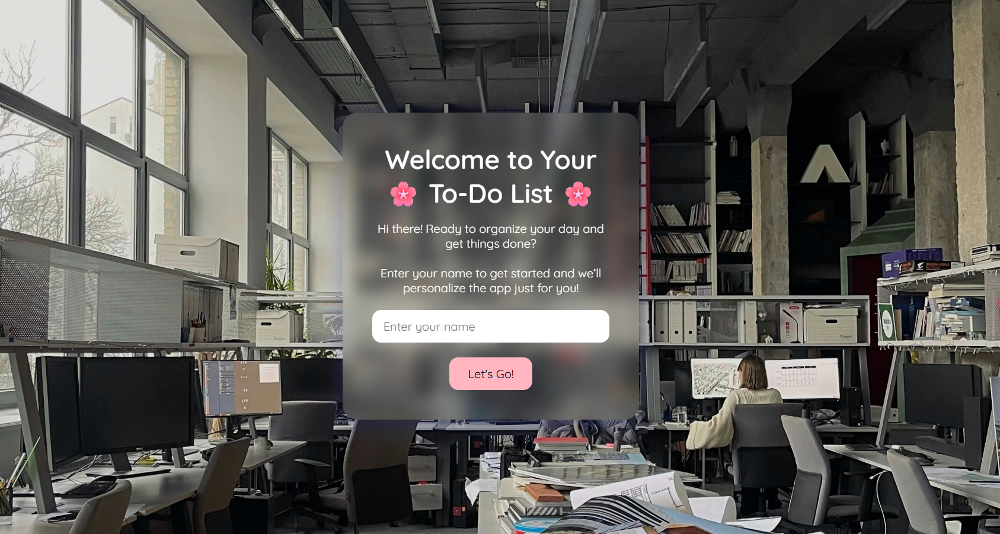
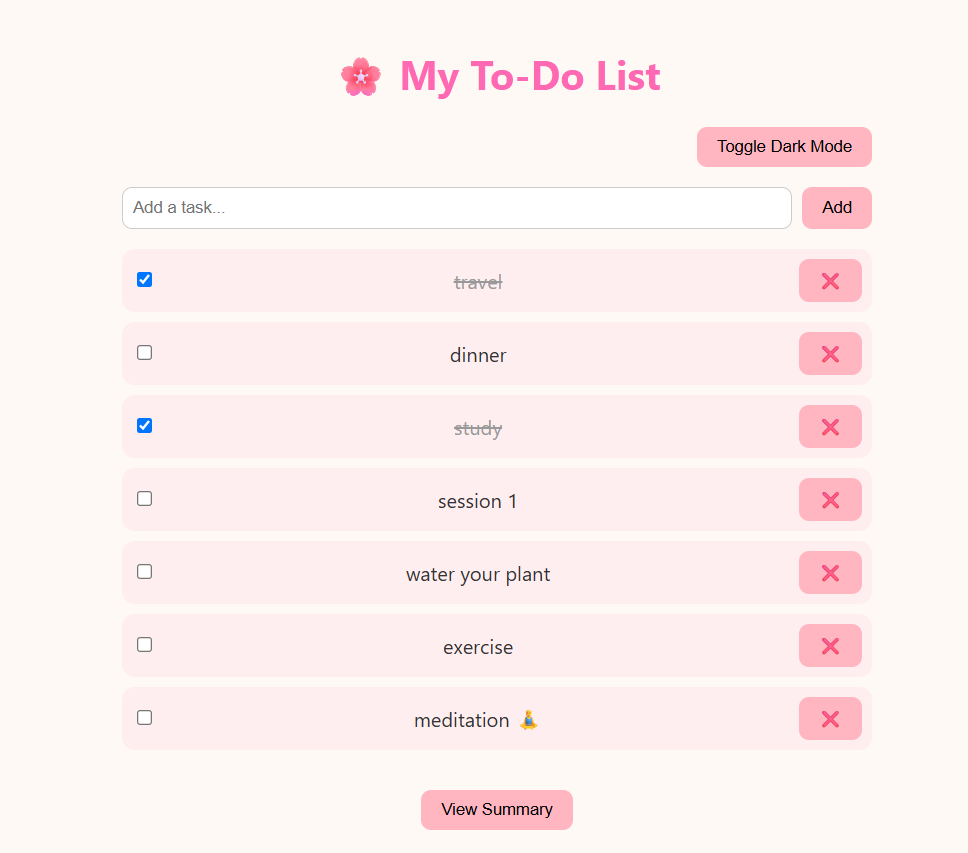
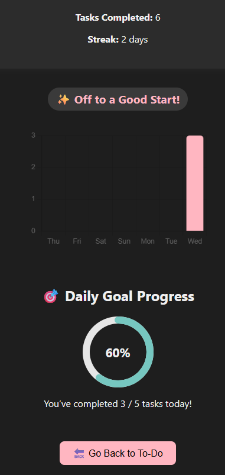

# ✅ To-Do List App — Simple, Fun, and Motivating

A lightweight, visually pleasing **To-Do List web app** built using HTML, CSS, and JavaScript. This app helps you **stay productive**, **track daily streaks**, and **celebrate wins** with fun animations and a beautiful summary dashboard.

---

## 🌟 Features

### 📝 Task Tracking
- Add, complete, and delete tasks effortlessly.
- Tracks total number of completed tasks.
- Simple checkbox-style completion system.

### 📊 Summary Dashboard
- Shows total tasks completed and current daily streak.
- Visual **calendar heatmap** to mark completed/missed days.
- Animated **goal completion ring** for daily progress.
- 🎉 **Confetti effect** triggers at 100% task completion.
- **Streak badges** are displayed as motivational rewards.

### 🌙 Dark Mode
- Toggle between light and dark themes with a **moon/sun icon**.
- Mobile-friendly placement and sticky behavior.
- Dark mode preference is saved using `localStorage`.

### 🎯 Motivation & Gamification
- Encouraging UI with celebratory animations.
- Streak system tracks your consistency.
- Milestone celebrations at key streak intervals (5, 10, 20, etc.).

### 📱 Fully Responsive Design
- Optimized layout for desktop, tablet, and mobile devices.
- Button and font sizes adapt to screen size.
- Smooth performance across browsers.

---

## 🛠️ Tech Stack

- **HTML5**, **CSS3**
- **Vanilla JavaScript**
- **LocalStorage** for saving tasks and settings
- **Canvas Confetti** library for visual celebrations

---

## 🚀 How to Run

```bash
# Clone this repository
git clone https://github.com/yourusername/your-repo-name.git

# Open todo.html in any modern browser
```

---

## 📸 Screenshots
### 🏠 Home / Input Page


### ✅ To-Do List Page


### 📊 Summary Page with Progress & Streaks


---

## 📌 Future Enhancements

- Task priorities and categories  
- Due dates and deadline reminders  
- User accounts with cloud sync  
- Export completed tasks  
- Sound feedback and custom celebrations  

---

## 🙌 Made with ❤️ by [VAISHNAVI MASHAKHETRI ]

A pastel-themed productivity booster built to make getting things done fun and visually satisfying!
